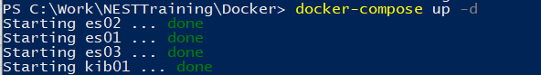

## III. BUILDING THE ELASTIC STACK CONTAINER

Similar to the certificates installation, building our Elastic Stack container is easy. And similar to that installation, we will still need powershell or git bash. Whichever you prefer.

You should still be navigating towards the Docker folder. We are going to use the docker-compose.yml file. Inside you'll find configuration to install 3 Elastic Search nodes and Kibana. Don't get intimidated by the code inside. All you have to do is run the following to start building your container.

    docker-compose up -d

With those few words, this builds and turns on your elastic stack container. See picture below:

With your Elastic Stack running, we are now ready to utilize it. However, at the moment, Kibana won't connect properly. This is related mostly to the authentication. We'll discuss and learn how to setup the connection with your own personal authentication.