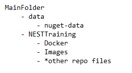

## VI. INDEXING THE DOCUMENTS
From the first mentioned requirements, you should've already downloaded the [Nuget Data](https://nusearch.blob.core.windows.net/dump/nuget-data-jul-2017.zip). If not, now's the perfect time. Should be around 2.5 GB.

Create a data folder on the same directory as the cloned local repository. The folder directory should be the structure below.

Once the data is full extracted and saved as the directory above suggests, it's time to open the solution. It should be located inside NESTTraining folder. The file is NuSearch.sln. Use Visual Studio 2019 to open this.

Once opened go to the NuSearch.Domain Module, go to appsettings.json. Since we setup a password to use our elastic search, we will have this application use our personal password as well. Set the password for user elastic from the generated passwords earlier. Also, if you changed the ports, update this to the same as the ELASTIC_PORT set in the .env file. Once updated, save the appsettings.json file.

Then, set up NuSearch.Indexer as the Startup Project. After which, build and run and the indexer should start indexing the documents from the raw data. It might take a few minutes. 

Once done, you should be able to confirm success by seeing something similar below.

Those files will now be index under the name '**nusearch**.'

With our elastic search nodes filled, let's confirm the total from Kibana. Similar to the healt query we used earlier, we'll enter the following command in dev tools and click the Play button.

    GET /nusearch/_count

The result should show as follows:

