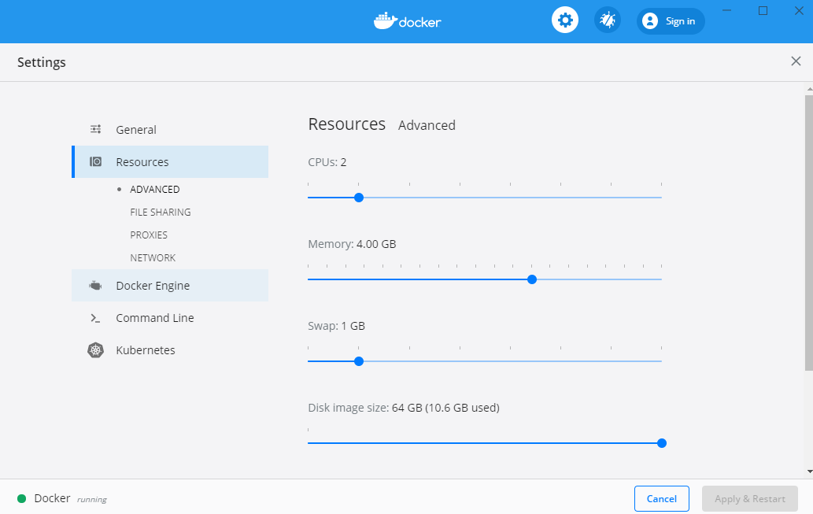
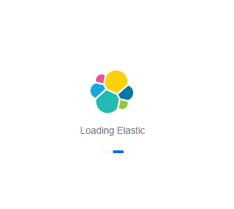
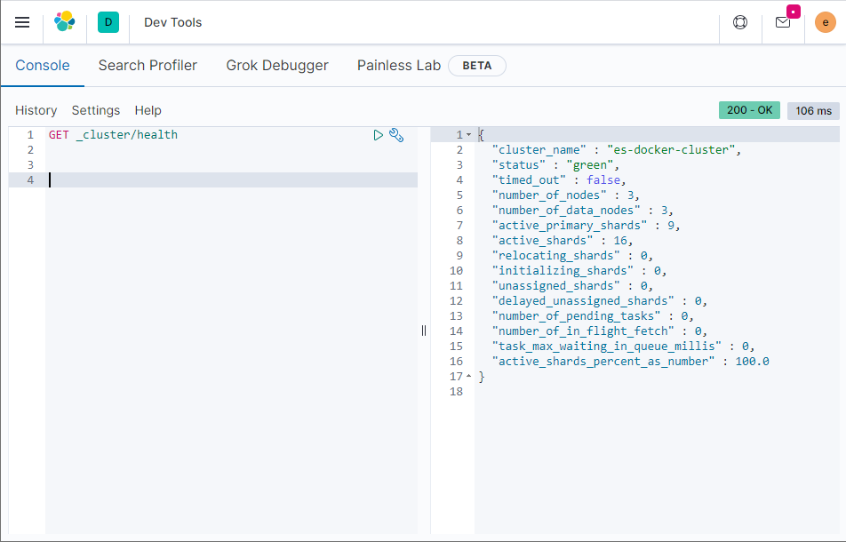
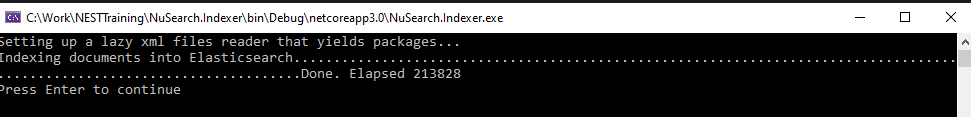
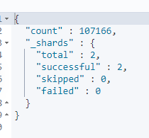

# **NEST Benchmarking with Elastic Search through Docker**

The initial goal with this project was to compare the 2 Elastic Search Libraries in .NET to determine advantages in use. Using Nuget data and Elastic Search engine, we made our own search page. This uses the basic version of Elastic Search, 7.8.

**Tested in:**
Windows 10
Visual Studio 2019

**Requirements:**
[Docker Desktop for Windows](https://docs.docker.com/get-docker/)
[Nuget Data](https://nusearch.blob.core.windows.net/dump/nuget-data-jul-2017.zip)
4GB RAM

## I. Installation

**I.a. Docker Installation**

Install Docker, open it, and go to settings. Go to Resource and set memory to about 4GB Ram.

To install, run in powershell/git bash the following on the docker folder containing the docker-compose.yml file.

    docker-compose up

This should setup 3 nodes for your elastic search and also Kibana, which would be accessible through http://localhost:5601.

You can go to Kibana Dev tools to verify this. Once there query the following and click on the query icon:

    GET /_cluster/health

You should get the following information confirming you have indeed 3 nodes. 

This is critical because we will be indexing a big number of documents.

**I.b. Running the indexer.**

Extract the data on the same folder as the solution (not inside).

Open the solution and set the NuSearch.Indexer as the Startup Project. Build and run and you should be able to confirm success by seeing something similar below.

The process will create documents from the data that we have and will create an index with name 'nusearch'.

You can confirm the total from Kibana, using the query below:

    GET /nusearch/_count

The result should show as follows:

II.