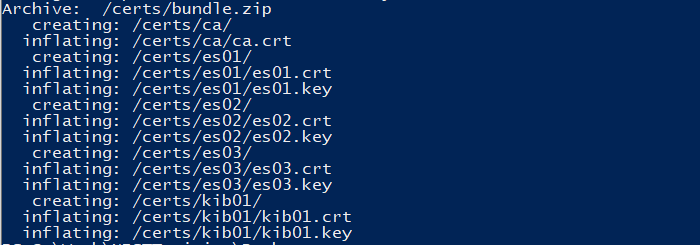
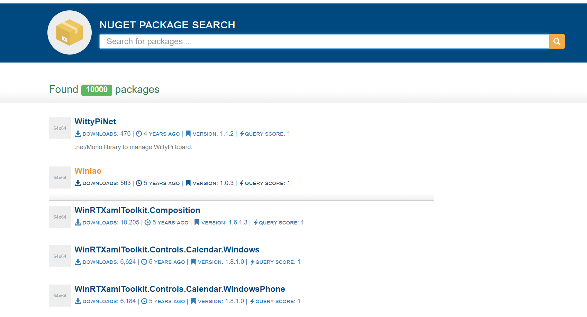
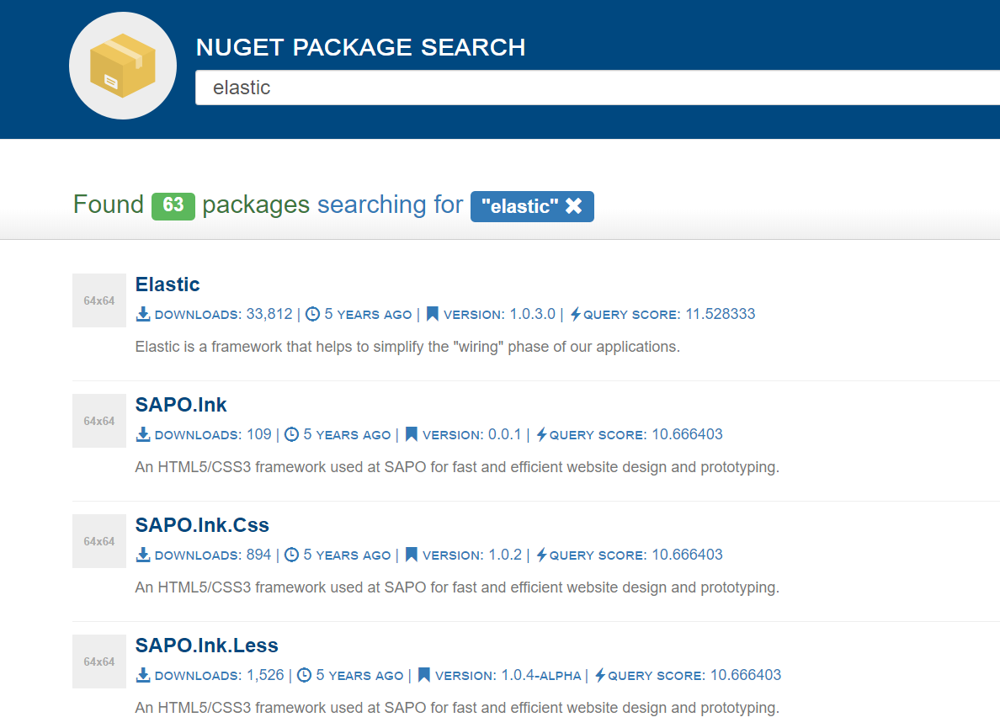

# **NEST with Elastic Search through Docker**

The initial goal with this project was to compare the 2 Elastic Search Libraries in .NET to determine advantages in use. Using Nuget data and Elastic Search engine, we made our own search page. This uses the basic version of Elastic Search, 7.8.

**About Nest**

NEST is a high level .NET Elastic Search Client that provides strongly typed one-to-one mapping .Net queries to Elastic Search queries. Due to that conversion, we expect an overhead which lead us to benchmark if it's a good compromise for more features and capabilities.

**Tested in:**
- Windows 10
- Visual Studio 2019

**Requirements:**

- [Docker Desktop for Windows](https://docs.docker.com/get-docker/)
- [Nuget Data](https://nusearch.blob.core.windows.net/dump/nuget-data-jul-2017.zip)
- 4GB RAM

## I. Installation

**I.A. DOCKER INSTALLATION**

Install Docker, open it, and go to settings. Go to Resource and set memory to about 4GB Ram.

As our Elastic Search includes authentication, you'll need to install some certificates. On the docker folder directory, open powershell/git bash and run the following code:

    docker-compose -f create-certs.yml run --rm create_certs

After you press enter, it should show you the following:

Still in powershell/git bash, run the following to start the elastic stack instances.

    docker-compose up

This should setup 3 nodes for your elastic search and also Kibana, which at the moment won't be able to connect yet. But we'll fix that as we move forward with more steps.

As part of the authentication process, you'll need to generate your own passwords. Run the following command on powershell/git bash:

    docker exec es01 /bin/bash -c "bin/elasticsearch-setup-passwords auto --batch --url https://es01:9200"

This runs a batch file that will generate passwords for your use, like the following:

Take note of your passwords, this is very important. To be specific, what you need are the **kibana_system and the elastic password** for this tutorial.

Once you have the passwords, get the kibana_user password and open the docker folder and the **.env file**. Look for **KIBANASYS_PASS** and update the value there to your **kibana_system password** from the generated passwords. 

***IMPORTANT!*** The .env file can also be used to change ports in the event that you are already using the default ports of 9200 and 5601. Just change the values after the = for the ELASTIC_PORT and KIBANA_PORT.

To update your changes, save the file. Then on back to the powershell/git bash, run the following command:

    docker-compose stop

Then the following:

    docker-compose up
    
This restarts your docker instances and applies your changes. Once everything is started, you can go to Kibana through https://localhost:{your current Kibana port on the .env file}. By default, this is 5601.

The login credentials can be found from the generated passwords still, the **elastic username and its corresponding password.**

You can go to Kibana Dev tools to verify this. Once there query the following and click on the query icon:

    GET /_cluster/health

You should get the following information confirming you have indeed 3 nodes. 

This is critical because we will be indexing a big number of documents.

**I.B. RUNNING THE INDEXER**

Extract the data on the same folder as the solution (not inside).

Open the solution and on NuSearch.Domain Module, go to appsettings.json. Here, set the password for user elastic from the generated passwords earlier. Also, if you changed the ports, update this to the same as the ELASTIC_PORT set in the .env file. Once updated, save and set NuSearch.Indexer as the Startup Project. 

Build and run and you should be able to confirm success by seeing something similar below.

The process will create documents from the data that we have and will create an index with name 'nusearch'.

You can confirm the total from Kibana, using the query below:

    GET /nusearch/_count

The result should show as follows:

## II. Usage
To use, set the startup project to NuSearch.Web and Run. You should now see the Search Webpage.

Try entering a keyword and click on Search. It should return some results.

## III. Common Errors and Discussion

Initially this was run through a non-docker local setup. But for portability and ease of use, we contained our elastic-kibana stack to a docker container.

Or First attempt was to just connect the code to a ready-made [Elk stack container made by deviantony](https://github.com/deviantony/docker-elk). Apart from making adjustments to the connection as this repository was using a trial version (one with monitoring), it was easy to connect. 

However, we encountered some limitations, as we attempt to index our multiple documents. As we ran our code, we come accross the error 429, or too many requests error. It occurs when the number of requests to the Elasticsearch cluster exceeds the bulk queue size.

We determined that the write requests were just too many for one node to handle. So we decided to write our own docker-compose file, which will contain only the ones we need, i.e., a multiple node Elastic Search and Kibana.

## IV. In Progress

 1. Multi Text Search 
 2. Analyzers
 3. ElasticSearch.NET Comparison

This project was a fork from [NEST 7.x Example](https://github.com/elastic/elasticsearch-net-example/tree/7.x) which was used and modified for our NEST/Elastic Search Training.

*For questions, please email g.mortillero@arcanys.com.*
